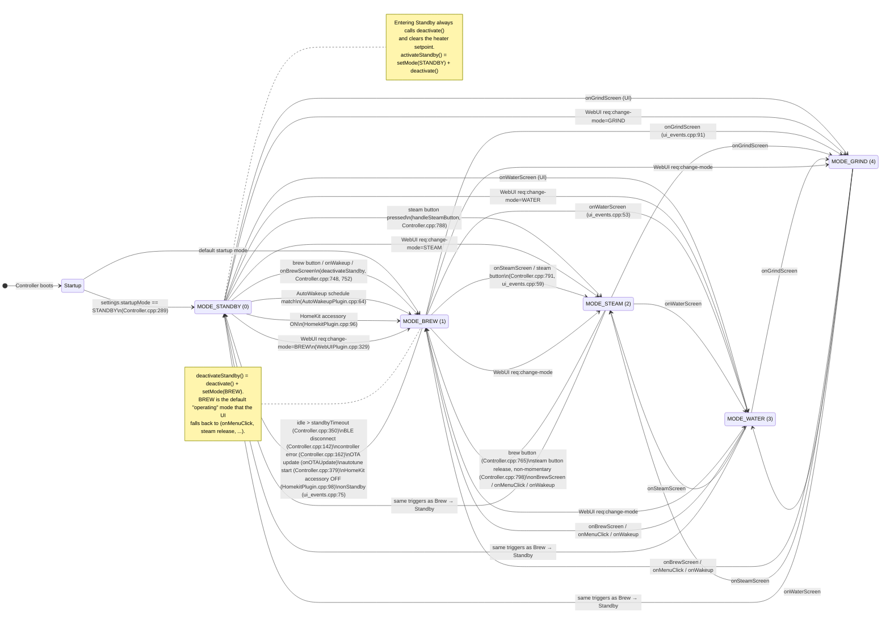
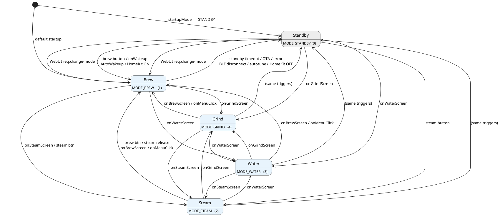

# Machine State Diagram (Modes)

This diagram models the machine modes tracked by `Controller::mode`
(see `src/display/core/constants.h`). The modes are:

| Value | Name           | Macro          |
|-------|----------------|----------------|
| 0     | Standby        | `MODE_STANDBY` |
| 1     | Brew           | `MODE_BREW`    |
| 2     | Steam          | `MODE_STEAM`   |
| 3     | Water          | `MODE_WATER`   |
| 4     | Grind          | `MODE_GRIND`   |

Mode transitions happen through `Controller::setMode(int)`
(`src/display/core/Controller.cpp:669`) or through the two helpers
`Controller::activateStandby()` / `Controller::deactivateStandby()`
(`src/display/core/Controller.cpp:647` / `:652`).

## Mermaid (editable / exportable)

The diagram below is written in [Mermaid] state-diagram syntax. GitHub renders
it inline; it can also be pasted into the [Mermaid Live Editor][live] to export
PNG / SVG / PDF.

[Mermaid]: https://mermaid.js.org/syntax/stateDiagram.html
[live]: https://mermaid.live

## PlantUML (alternate, also editable)

## Source references

All mode transitions found via `setMode` / `activateStandby` / `deactivateStandby`:

| Trigger                                    | Source location                              | Target mode  |
|--------------------------------------------|----------------------------------------------|--------------|
| Startup (startupMode == STANDBY)           | `Controller.cpp:289`                         | STANDBY      |
| BLE disconnect                             | `Controller.cpp:142`                         | STANDBY      |
| Remote / controller error                  | `Controller.cpp:162`                         | STANDBY      |
| Standby idle timeout                       | `Controller.cpp:350`                         | STANDBY      |
| Autotune start                             | `Controller.cpp:378-379`                     | STANDBY      |
| OTA update                                 | `Controller.cpp:686-687`                     | STANDBY      |
| `activateStandby()` helper                 | `Controller.cpp:647`                         | STANDBY      |
| `deactivateStandby()` helper               | `Controller.cpp:652-654`                     | BREW         |
| Brew button in STANDBY                     | `Controller.cpp:747-748`                     | BREW         |
| Brew button in BREW (wake)                 | `Controller.cpp:750-752`                     | BREW         |
| Brew button in STEAM                       | `Controller.cpp:763-765`                     | BREW         |
| Steam button in STANDBY                    | `Controller.cpp:787-788`                     | STEAM        |
| Steam button in BREW                       | `Controller.cpp:790-791`                     | STEAM        |
| Steam button release (non-momentary)       | `Controller.cpp:796-798`                     | BREW         |
| UI: onBrewScreen                           | `ui_events.cpp:48`                           | BREW         |
| UI: onWaterScreen                          | `ui_events.cpp:53`                           | WATER        |
| UI: onSteamScreen                          | `ui_events.cpp:59`                           | STEAM        |
| UI: onWakeup                               | `ui_events.cpp:70`                           | BREW         |
| UI: onStandby                              | `ui_events.cpp:75`                           | STANDBY      |
| UI: onMenuClick                            | `ui_events.cpp:85`                           | BREW         |
| UI: onGrindScreen                          | `ui_events.cpp:91`                           | GRIND        |
| AutoWakeup schedule match                  | `AutoWakeupPlugin.cpp:64`                    | BREW         |
| HomeKit accessory ON                       | `HomekitPlugin.cpp:96`                       | BREW         |
| HomeKit accessory OFF                      | `HomekitPlugin.cpp:98`                       | STANDBY      |
| WebUI `req:change-mode`                    | `WebUIPlugin.cpp:329`                        | any          |
